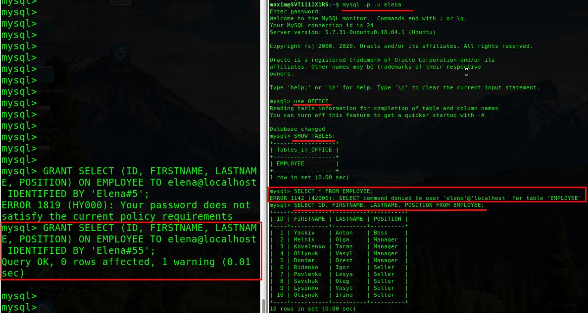
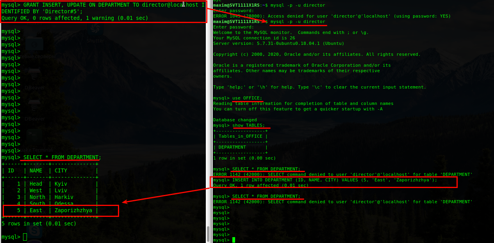
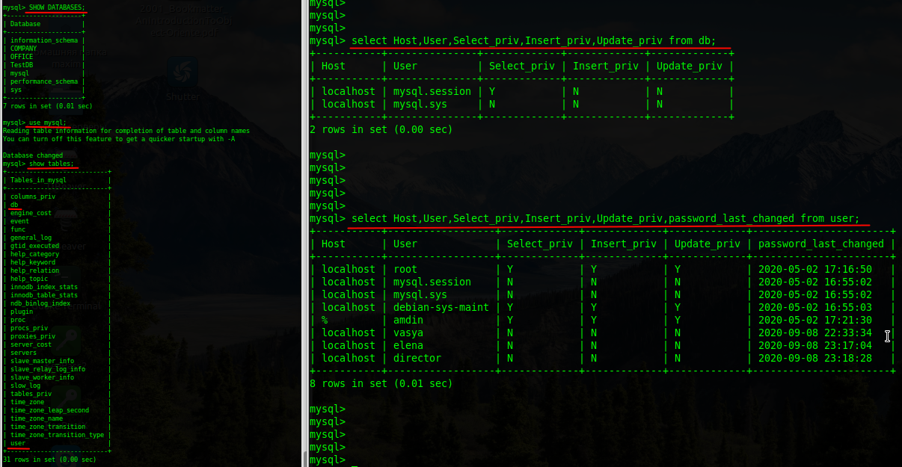

## Task 3.1
### Module 3 Database Administration

**3.1.1.** Download MySQL server for your OS.  

I have installed MySQL DB on the remote server `SVT1111X1RS` (192.168.6.12).  
I work on the local machine `HP4330` (192.168.6.11). Both have local users `maxim`.  

The remote `root` MySQL login is restricted. Allowed only local `root` MySQL login.  
So lets go connect SSH to the DB server, check the version, and connect MySQL there:  
```
# local machine, HP4330 (192.168.6.11):
uname -a
hostname
whoami

ssh maxim@192.168.6.12
# remote server, SVT1111X1RS (192.168.6.12):
uname -a
hostname
whoami

mysql --version
mysql -p -u root
SELECT version ();
```
  

**3.1.2.** Install MySQL server.  

I have installed MySQL DB on the remote server `SVT1111X1RS` (192.168.6.12).  
I work on the local machine `HP4330` (192.168.6.11). Both have local users `maxim`.  

The MySQL server has an `amdin` DB user, who is allowed to connect MySQL remotely.  
So lets go remote connect the DB server with MySQL `amdin` user, check the version:  
```
# local machine, HP4330 (192.168.6.11):
uname -a
hostname
whoami

mysql -h 192.168.6.12 -p -u amdin
# remote server, SVT1111X1RS (192.168.6.12):

SELECT version();
```
  

- _**Pay attention,** on the next steps I use remote connection to the MySQL with `amdin` credentials._  

**3.1.3.** Describe the database schema (minimum 3 tables).  

The office is divided into departments that have names and are located in different cities.  
For each office employee there first and last name, date of employment, position, monthly rate.  
Each employee belongs to only one department.  
Each employee has only one boss. The president of the office does not have a boss.  
If the employee works as a salesman, he receives an additional compensation at the end of year.  
Each employee belongs to a group depending on his salary.  
For each group, the lower and upper limit of salary is determined.  

  

**3.1.4.** Create a database on the server through the console.  
```
# Create a database named `OFFICE` and switch to it.
CREATE DATABASE OFFICE;
USE OFFICE;

# Create a table 1 named DEPARTMENT, which has the ID field of integer type, 
# and NAME and CITY fields of string type with the length limited by 30 characters.
CREATE TABLE DEPARTMENT (ID INT, NAME VARCHAR(30), CITY VARCHAR(30));

# Create a table 2 named EMPLOYEE with the following fields: 
# ID (key field), FIRSTNAME, LASTNAME, POSITION – string type, 
# DATE_EMPLOYMENT – date type, ID_DEPARTMENT, ID_BOSS, RATE, BONUS – integer type.
CREATE TABLE EMPLOYEE (ID INT PRIMARY KEY,
FIRSTNAME VARCHAR(30),
LASTNAME VARCHAR(30),
POSITION VARCHAR(10),
DATE_EMPLOYMENT DATE,
ID_DEPARTMENT INT,
ID_BOSS INT,
RATE INT, 
BONUS INT);

# Create a table 3 named SALARY_GRADE with the following fields: ID (key field), 
# lower and upper salary bounds LOW_SALARY, HIGH_SALARY – integer type.
CREATE TABLE SALARY_GRADE (ID INT PRIMARY KEY, LOW_SALARY INT, HIGH_SALARY INT);

# Display what was created:
SHOW TABLES;
```
  

**3.1.5.** Fill in tables.  
```
INSERT INTO DEPARTMENT(ID, NAME, CITY) VALUES (1, 'Head', 'Kyiv');
INSERT INTO DEPARTMENT(ID, NAME, CITY) VALUES (2, 'West', 'Lviv');
INSERT INTO DEPARTMENT(ID, NAME, CITY) VALUES (3, 'North', 'Harkiv');
INSERT INTO DEPARTMENT(ID, NAME, CITY) VALUES (4, 'South', 'Odessa');

INSERT INTO EMPLOYEE (ID, FIRSTNAME, LASTNAME, POSITION, DATE_EMPLOYMENT, ID_DEPARTMENT, ID_BOSS, RATE, BONUS) 
	VALUES (1, 'Yaskiv', 'Anton', 'Boss', STR_TO_DATE('10/11/1998','%m/%d/%Y'), 1, NULL, 8600, NULL);
INSERT INTO EMPLOYEE (ID, FIRSTNAME, LASTNAME, POSITION, DATE_EMPLOYMENT, ID_DEPARTMENT, ID_BOSS, RATE, BONUS) 
	VALUES (2, 'Melnik', 'Olga', 'Manager', STR_TO_DATE('03/09/2011','%m/%d/%Y'), 1, 1, 5400, NULL);
INSERT INTO EMPLOYEE (ID, FIRSTNAME, LASTNAME, POSITION, DATE_EMPLOYMENT, ID_DEPARTMENT, ID_BOSS, RATE, BONUS) 
	VALUES (3, 'Kovalenko', 'Taras', 'Manager', STR_TO_DATE('04/15/2008','%m/%d/%Y'), 2, 1, 4800, NULL);
INSERT INTO EMPLOYEE (ID, FIRSTNAME, LASTNAME, POSITION, DATE_EMPLOYMENT, ID_DEPARTMENT, ID_BOSS, RATE, BONUS) 
	VALUES (4, 'Oliynuk', 'Vasyl', 'Manager', STR_TO_DATE('11/25/2010','%m/%d/%Y'), 3, 1, 6000, NULL);
INSERT INTO EMPLOYEE (ID, FIRSTNAME, LASTNAME, POSITION, DATE_EMPLOYMENT, ID_DEPARTMENT, ID_BOSS, RATE, BONUS) 
	VALUES (5, 'Bondar', 'Orest', 'Manager', STR_TO_DATE('06/22/2015','%m/%d/%Y'), NULL, 1, 4900, NULL);
INSERT INTO EMPLOYEE (ID, FIRSTNAME, LASTNAME, POSITION, DATE_EMPLOYMENT, ID_DEPARTMENT, ID_BOSS, RATE, BONUS) 
	VALUES (6, 'Ridenko', 'Igor', 'Seller', STR_TO_DATE('04/11/2006','%m/%d/%Y'), 1, 2, 3500, 360);
INSERT INTO EMPLOYEE (ID, FIRSTNAME, LASTNAME, POSITION, DATE_EMPLOYMENT, ID_DEPARTMENT, ID_BOSS, RATE, BONUS) 
	VALUES (7, 'Pavlenko', 'Lesya', 'Seller', STR_TO_DATE('04/14/2004','%m/%d/%Y'), 1, 2, 3200, 390);
INSERT INTO EMPLOYEE (ID, FIRSTNAME, LASTNAME, POSITION, DATE_EMPLOYMENT, ID_DEPARTMENT, ID_BOSS, RATE, BONUS) 
	VALUES (8, 'Savchuk', 'Oleg', 'Seller', STR_TO_DATE('09/28/1996','%m/%d/%Y'), 1, 2, 2500, 450);
INSERT INTO EMPLOYEE (ID, FIRSTNAME, LASTNAME, POSITION, DATE_EMPLOYMENT, ID_DEPARTMENT, ID_BOSS, RATE, BONUS) 
	VALUES (9, 'Lysenko', 'Vasyl', 'Seller', STR_TO_DATE('10/01/2015','%m/%d/%Y'), 1, 2, 2200, 500);
INSERT INTO EMPLOYEE (ID, FIRSTNAME, LASTNAME, POSITION, DATE_EMPLOYMENT, ID_DEPARTMENT, ID_BOSS, RATE, BONUS) 
	VALUES (10, 'Oliynuk', 'Irina', 'Seller', STR_TO_DATE('01/05/2003','%m/%d/%Y'), 1, 2, 3400, 420);

INSERT INTO SALARY_GRADE (ID, LOW_SALARY, HIGH_SALARY) VALUES (1, 6000, 9000);
INSERT INTO SALARY_GRADE (ID, LOW_SALARY, HIGH_SALARY) VALUES (2, 3000, 5999);
INSERT INTO SALARY_GRADE (ID, LOW_SALARY, HIGH_SALARY) VALUES (3, 1001, 2999);
INSERT INTO SALARY_GRADE (ID, LOW_SALARY, HIGH_SALARY) VALUES (4, 0, 1000);
```
  

**3.1.6.** Execute SQL queries DDL, DML, DCL.  

**DDL** _(Data Definition Language)_. It is used to define database structure or pattern.  
These are `Create, Alter, Drop, Truncate, Rename, Comment` commands.  

- Add to the DEPARTMENT table a field named STREET which would contain  a street name with length limited by 40 characters.  
- Change the length of the STREET field from 40 to 30 characters.  
- Remove the STREET field from DEPARTMENT table.  
```
SHOW COLUMNS FROM DEPARTMENT;

ALTER TABLE DEPARTMENT ADD STREET VARCHAR (40);
SHOW COLUMNS FROM DEPARTMENT;

ALTER TABLE DEPARTMENT MODIFY COLUMN STREET VARCHAR(30);
SHOW COLUMNS FROM DEPARTMENT;

ALTER TABLE DEPARTMENT DROP COLUMN STREET;
SHOW COLUMNS FROM DEPARTMENT;
```
  

**DML** _(Data Manipulation Language)_. It is used for accessing and manipulating data in a database.  
These are `Select, Insert, Update, Delete, Merge, Call, Explain Plan, Lock Table` commands.  

- Add a new record to the DEPARTMENT table with the following field values: ID = 5, NAME = ‘East‘, CITY = 'Zaporizhzhya'.
- Add a new employee to the EMPLOYEЕ table who works in the 5th department.
```
INSERT INTO DEPARTMENT (ID, NAME, CITY) VALUES (5, 'East', 'Zaporizhzhya');
SELECT * FROM DEPARTMENT;

INSERT INTO EMPLOYEE (ID, LASTNAME, FIRSTNAME, POSITION, DATE_EMPLOYMENT, ID_DEPARTMENT, ID_BOSS, RATE, BONUS) VALUES (25, 'Semeniv', 'Anatoliy', 'Seller', '2014-10-07', 5, 1, 3200, 400);
SELECT * FROM EMPLOYEE;
```
  

- Increase a salary for the 25th employee in one and a half times.
- Remove the record about 25th employee from EMPLOYEЕ table.
- Remove the record about 5th department from DEPARTMENT table.
```
SELECT * FROM EMPLOYEE WHERE ID = 25;
UPDATE EMPLOYEE SET RATE = RATE * 1.5 WHERE ID = 25;
SELECT * FROM EMPLOYEE WHERE ID = 25;

DELETE FROM EMPLOYEE WHERE ID = 25;
SELECT * FROM EMPLOYEE WHERE ID = 25;

DELETE FROM DEPARTMENT WHERE ID = 5;
SELECT * FROM DEPARTMENT;
```
  

**DCL** _(Data Control Language)_. It is used to retrieve the stored or saved data.  
These are `Grant, Revoke` commands for the `Connect, Insert, Usage, Delete, Update, Select` permissions.  

Next command will create a new MySQL user `vasya` with password `Pupkin#5`.  
And provide him permissions to the `SELECT` command on the`EMPLOYEE` table:  
```
# Invoke the command under the `amdin` user (see the left screenshot):
GRANT SELECT ON EMPLOYEE TO vasya@localhost IDENTIFIED BY 'Pupkin#5';

# Login to the MySQL server with the new user and run command (see right screen):
mysql -p -u vasya
use OFFICE;
SHOW TABLES;
SELECT * FROM EMPLOYEE;
```
  

These commands take back permission for user `vasya` on the `EMPLOYEE` table.  
After that provide him permissions to the `SELECT` command on the`DEPARTMENT` table:  
```
# Invoke the command under the `amdin` user (see the left screenshot):
REVOKE SELECT ON EMPLOYEE FROM vasya@localhost;

# Login to the MySQL server with the `vasya` user and run command (see right screen):
mysql -p -u vasya
use OFFICE;
SHOW TABLES;
___

# Invoke the command under the `amdin` user (see the left screenshot):
GRANT SELECT ON EMPLOYEE FROM vasya@localhost;

# Run the command under the `vasya` user  (see the right screenshot):
SHOW TABLES;
SELECT * FROM DEPARTMENT;
```
  

**3.1.7.** Create database users with different rights.  

- Create the user `elena` with partial permissions for view only some columns:  
```
# Invoke the command under the `amdin` user (see the left screenshot):
GRANT SELECT (ID, FIRSTNAME, LASTNAME, POSITION) ON EMPLOYEE TO elena@localhost IDENTIFIED BY 'Elena#55';

# Login to the MySQL server with the `elena` user and run command (see right screen):
mysql -p -u elena
use OFFICE;
SHOW TABLES;
SELECT * FROM EMPLOYEES;
SELECT ID, FIRSTNAME, LASTNAME, POSITION FROM EMPLOYEES;
```
  

- Create the user `director` with permissions for insert/update, without view data:  
```
# Invoke the command under the `amdin` user (see the left screenshot):
GRANT INSERT, UPDATE ON DEPARTMENT TO director@localhost IDENTIFIED BY 'Director#5';

# Login to the MySQL server with the `director` user and run command (see right screen):
mysql -p -u director
use OFFICE;
SHOW TABLES;
SELECT * FROM DEPARTMENT;
INSERT INTO DEPARTMENT (ID, NAME, CITY) VALUES (5, 'East', 'Zaporizhzhya');
SELECT * FROM DEPARTMENT;

# Invoke the command under the `amdin` user (see the left screenshot):
SELECT * FROM DEPARTMENT;
```
  

**3.1.8.** Make a selection from the main table DB MySQL.  
```
show databases;
use mysql;
show tables;

select Host,Db,User,Select_priv from db;
select Host,User,Select_priv,Insert_priv,Update_priv,password_last_changed from user;
```
  
___
 
_Thanks for your time!_  
 
