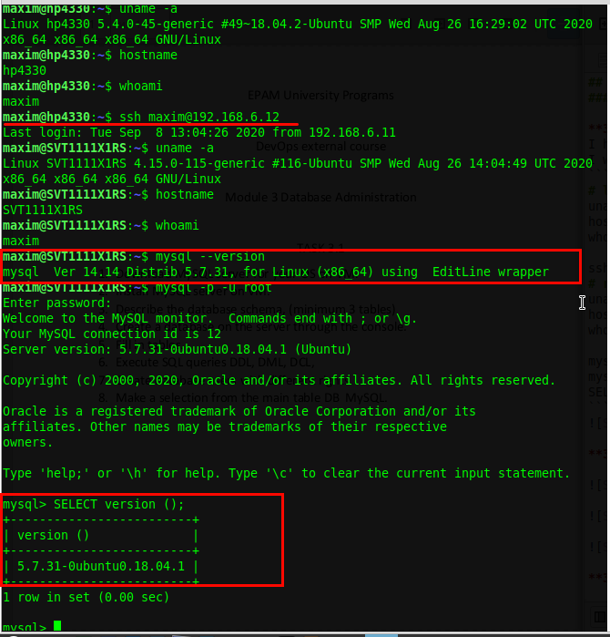
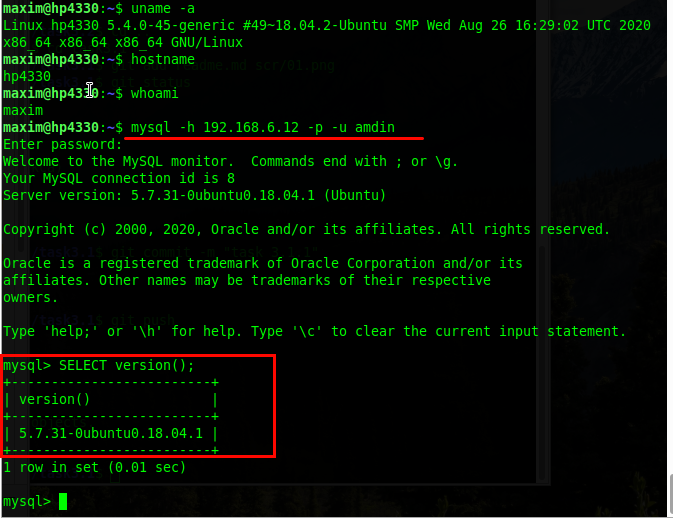
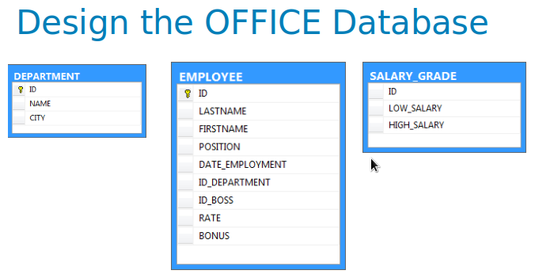
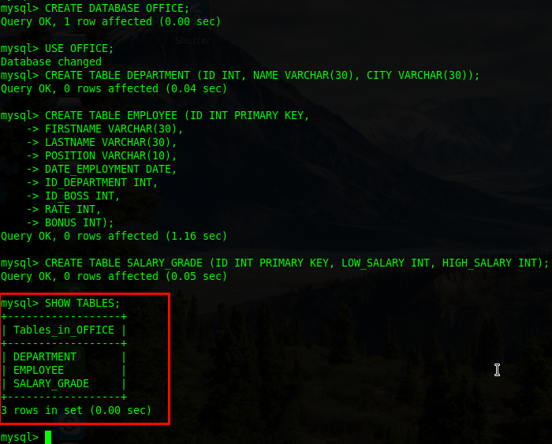
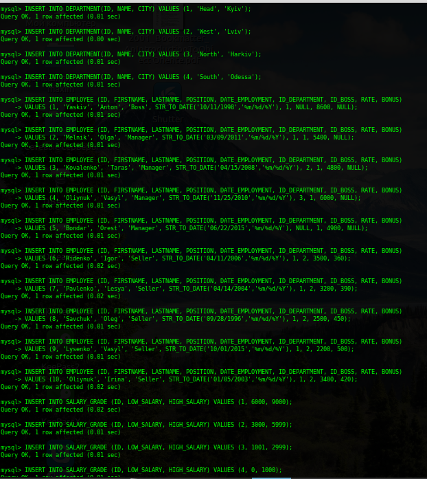
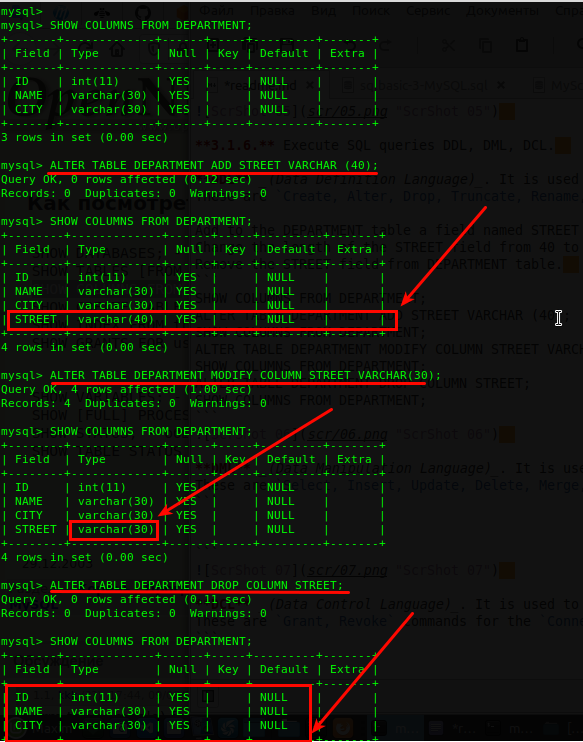
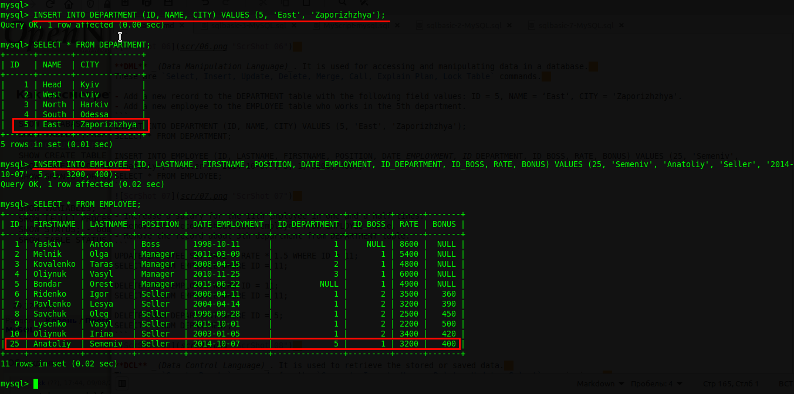
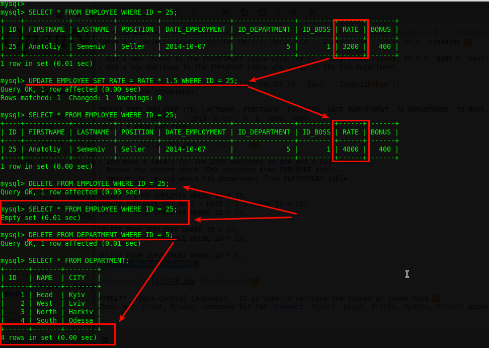
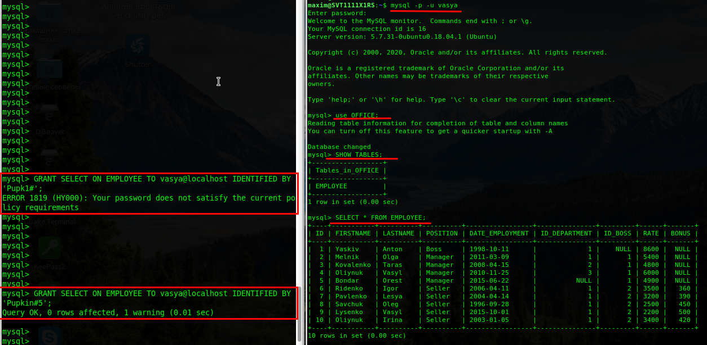
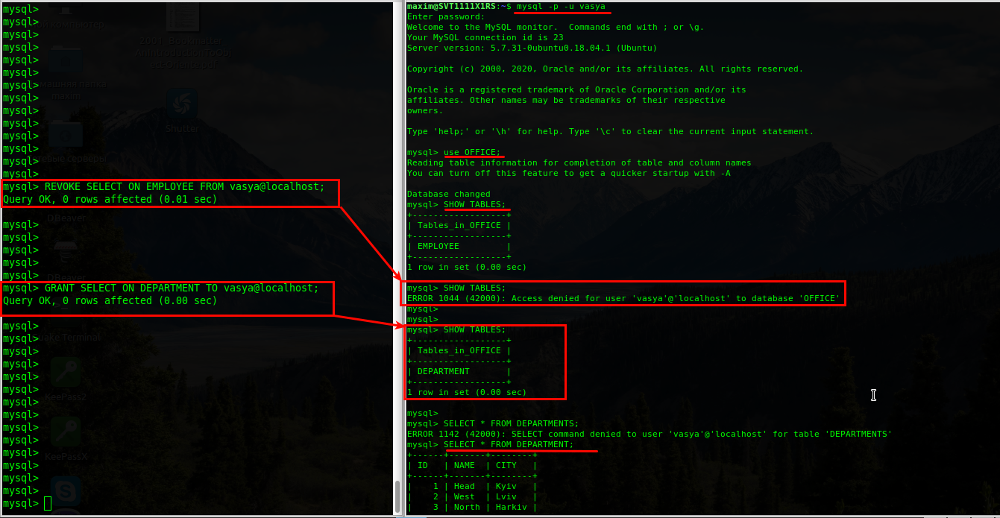

## Task 3.1
### Module 3 Database Administration

**3.1.1.** Download MySQL server for your OS.  

  

  

**3.1.2.** Install MySQL server.  

  

  

**3.1.3.** Describe the database schema (minimum 3 tables).  

  

**3.1.4.** Create a database on the server through the console.  

  

**3.1.5.** Fill in tables.  

  

**3.1.6.** Execute SQL queries DDL, DML, DCL.  

  

**3.1.7.** Create database users with different rights.  

  

**3.1.8.** Make a selection from the main table DB MySQL.  

  
___
 
_Thanks for your time!_  
