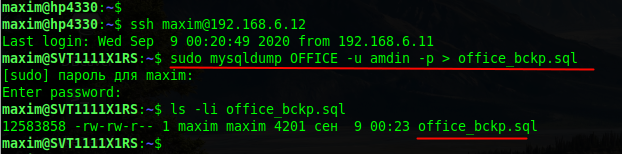
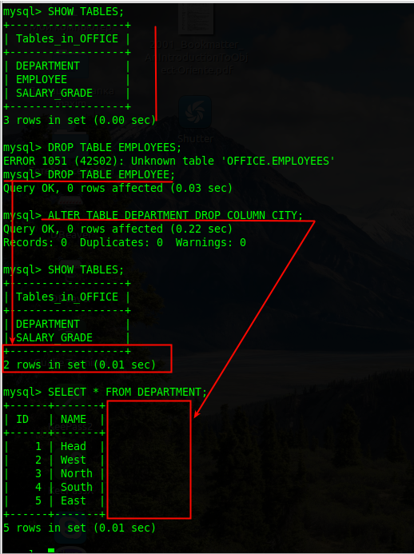
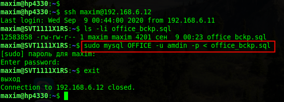
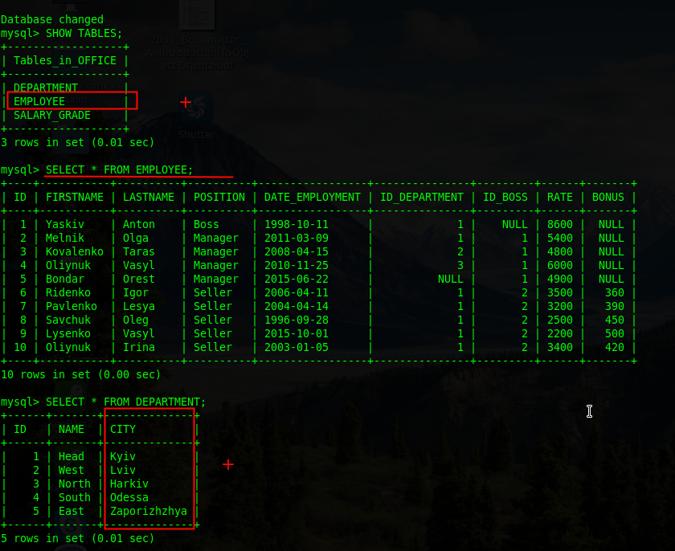
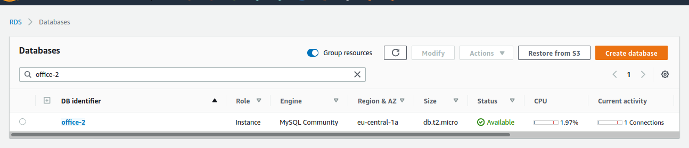
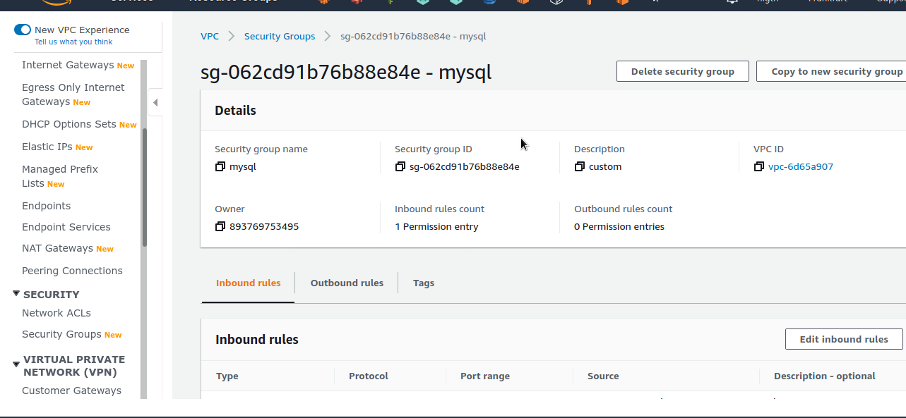
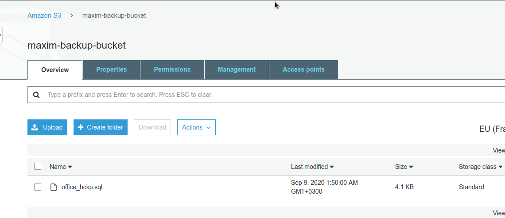
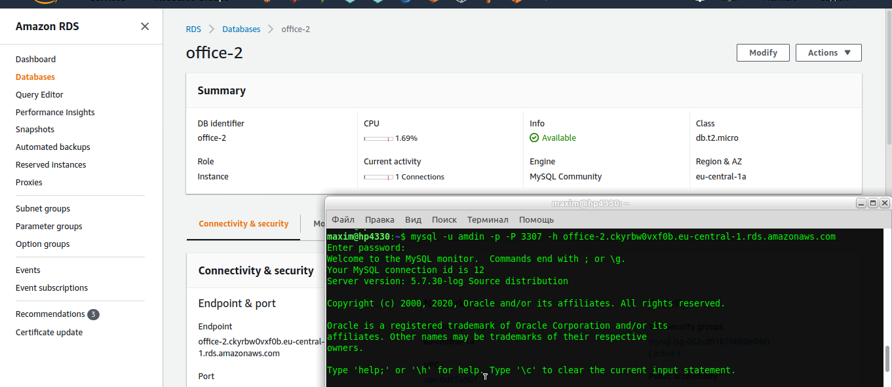
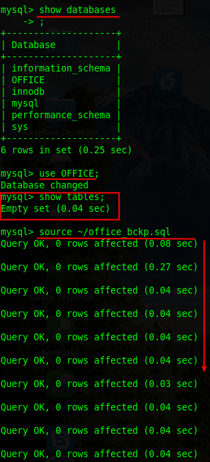
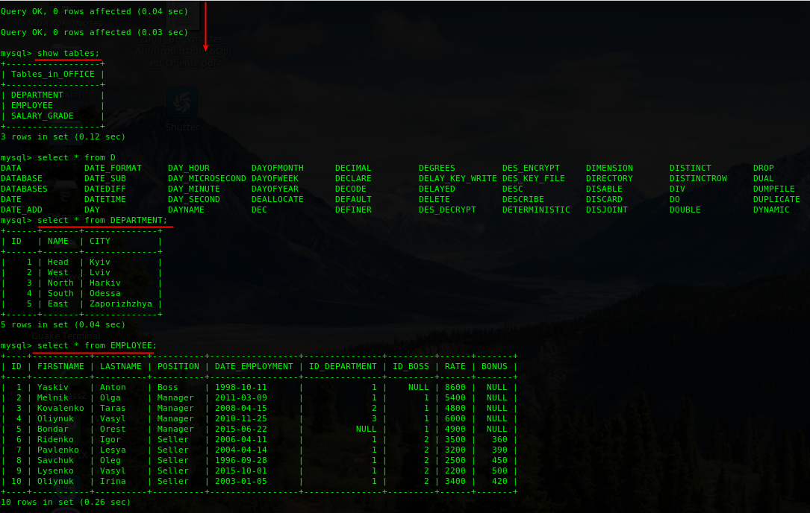

## Task 3.2
### Module 3 Database Administration

**3.2.1.** Make backup of your database.  

  

  

**3.2.2.** Delete the table and / or part of the data in the table.  

  

  

**3.2.3.** Restore your database.  

  

**3.2.4.** Transfer your local database to RDS AWS.  

  

  

  

  

  
___
 
_Thanks for your time!_  
