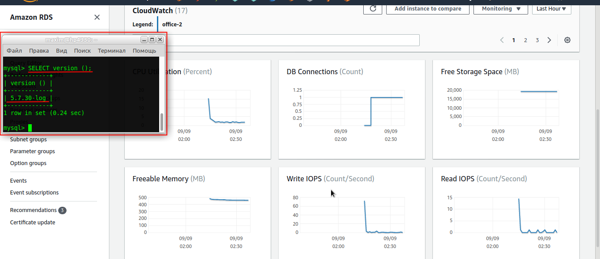

## Task 3.2
### Module 3 Database Administration

**3.2.1.** Make backup of your database.  
```
ssh maxim@192.168.6.12
sudo mysqldump OFFICE -u amdin -p > office_bckp.sql
ls -li office_bckp.sql
exit
```
  

**3.2.2.** Delete the table EMPLOYEES and all data from the column CITY of the DEPARTMENT table.  
```
mysql -h 192.168.6.12 -p -u amdin
USE OFFICE;
SHOW TABLES;

DROP TABLE EMPLOYEE;
ALTER TABLE DEPARTMENT DROP COLUMN CITY;

SHOW TABLES;
SELECT * FROM DEPARTMENT;
QUIT;
```
  

**3.2.3.** Restore your database.  
```
ssh maxim@192.168.6.12
ls -li office_bckp.sql
sudo mysql OFFICE -u amdin -p < office_bckp.sql
exit
```
  

Check the data restored:  
```
mysql -h 192.168.6.12 -p -u amdin
USE OFFICE;
SHOW TABLES;
SELECT * FROM EMPLOYEE;
SELECT * FROM DEPARTMENT;
```
  

**3.2.4.** Transfer your local database to RDS AWS.  

The helpful post is here on the blog:  
https://www.1strategy.com/blog/2017/10/03/migrating-a-mysql-database-to-rds/

- Create the RDS instance:  
REGION - Europe (Frankfurt) eu-central-1;
Standard Create;  
Engine options - MySQL;  
Edition - MySQL community ver MySQL 5.7.30;  
Templates - Free Tier;  
Settings:  
DB instance identifier - office-2;  
Initial database name - OFFICE;  
  

Also create a Security Group for the VPC to restrict access from my IP address:  
  

Upload the `office_bckp.sql` file to the S3 bucket:  
  

- Log into the RDS MySQL instance and import the database by referencing the file saved from mysqldump  
```
mysql -u amdin -p -h office-2.ckyrbw0vxf0b.eu-central-1.rds.amazonaws.com  

show databases;
use OFFICE;
show tables;
source ~/office_bckp.sql;

show tables;
select * from DEPARTMENT;
select * from EMPLOYEE;

SELECT version ();
```

See that data restored successfully.  
The MySQL versions are different - on the AWS RDS - 5.7.30-log, on my host I have - 5.7.31-ubuntu (see task 3.1).  
  

  

  

  
___
 
_Thanks for your time!_  
