## Task 5.4
### Module 5. Linux

**1. User management.** I have 3 users in my system: `ROOT`, `MAXIM` and `GUEST`. Here a new user `USER` will be created.  

**1.1.** Create a new user `user`  
```
sudo groupadd user
sudo useradd -g user -s /bin/bash -d /home/user -m user
sudo passwd user
id user
ls -ld /home/user
```
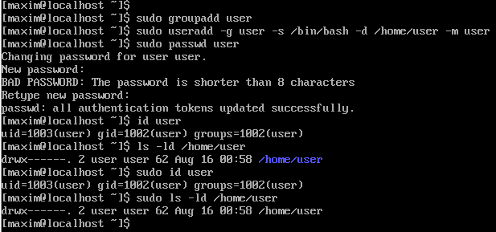  

**1.2.** Log in to the system as `user` _(hint: use `su`)._  
```
su user
whoami
```
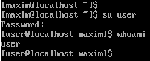  

**1.3.** Edit `/etc/passwd` to prevent user `user` from logging in to the system.  
The user `user` isn't sudoers, he can only read `/etc/passwd`.  
I need to logout from `user`, and change **`/bin/bash`** in the `/etc/passwd` to **`/bin/nologin`** and try to login again:  
```
exit
sudo vi /etc/passwd
su user
```

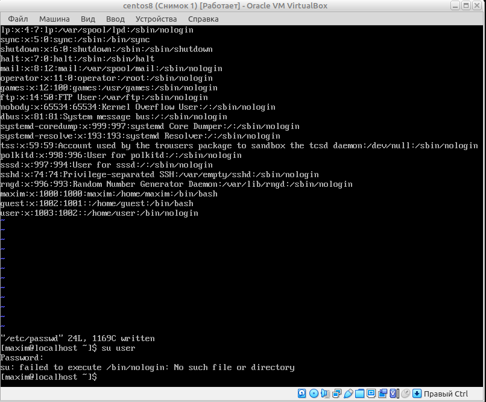  

**2. Content of `/etc/passwd` and `/etc/group`.**  

**2.1.** Look through `/etc/passwd` and `/etc/group` _(hint: use `less` or `cat`)._  
```
cat /etc/group
less /etc/group
```
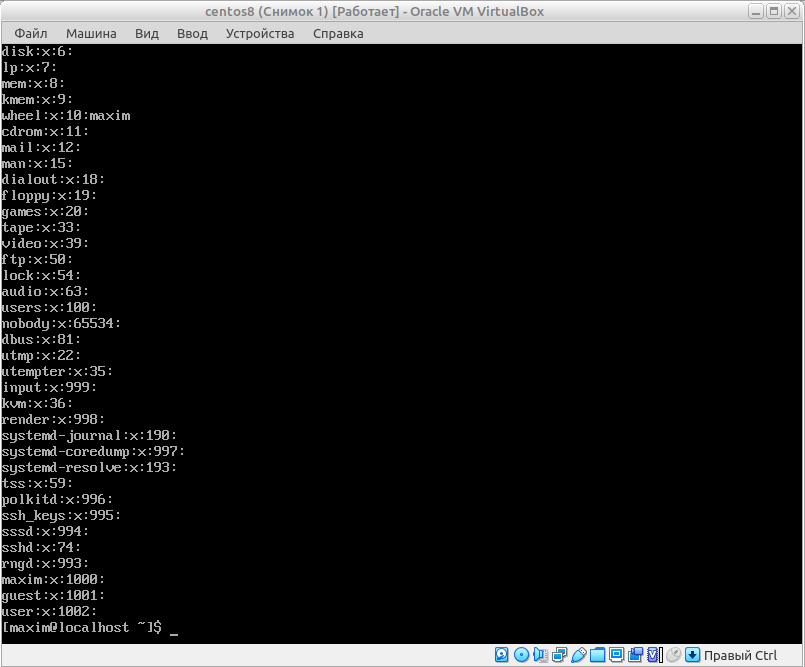  
```
cat /etc/passwd
less /etc/passwd
```
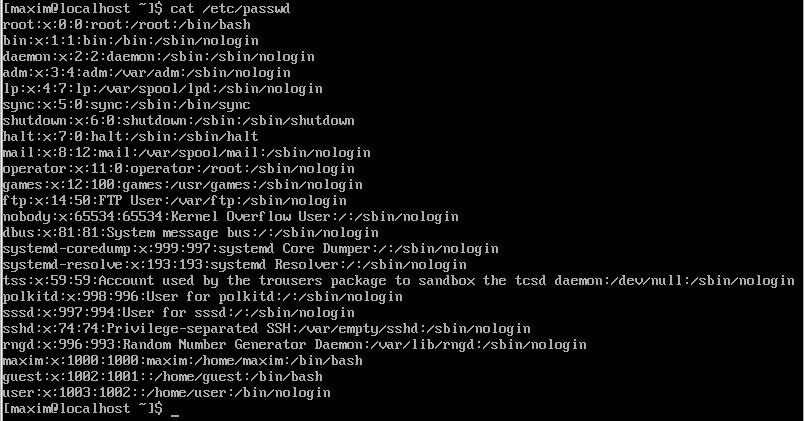  

**2.2.** Get data from `/etc/passwd` and `/etc/group` about users: `root`, `guest`, `user`, `maxim` _(hint: filter by `grep`)._  
```
grep -e user -e guest -e root /etc/passwd
grep -e user -e gurst -e root /etc/group
```
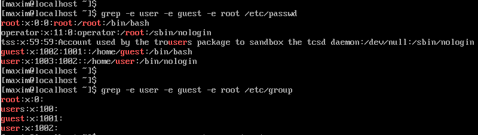  

**2.3.** Parse `/etc/passwd` and `/etc/group` with `cut`.  
```
cut -f1 -d: /etc/passwd
cut -f1,2 -d: /etc/passwd
cut -f1,7 -d: /etc/passwd
```
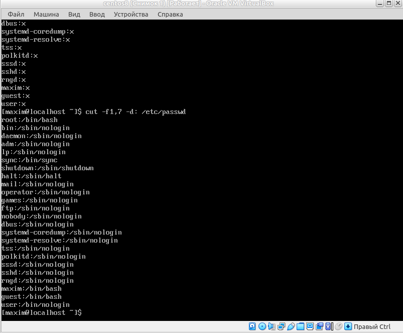  
```
cut -f1 -d: /etc/group
cut -f1,2 -d: /etc/group
```
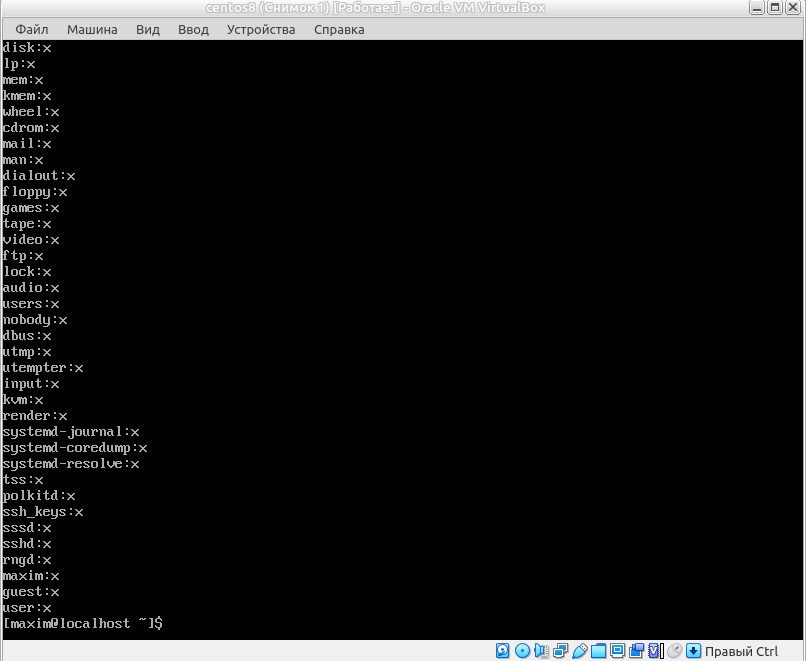  

**2.4.** Try to call `less` on `/etc/shadow` and invoke _(analyse content of `/etc/shadow` based on what was found in `man 5 shadow`):_  
```
man -k shadow
man 5 shadow
sudo less /etc/shadow
```
The `/etc/shadow` is a file of encrypted password. It sonsists of fields such as username, cipher password, date of password changed, time of password life, maximum period of password is valid, period about remaining of change password, period in which teh password can't be changed, time of endlife of user account, and the reserved field.
  

**3. Dealing with `chmod`.** 

**3.1.** An executable script. Create a file, edit him, print what is inside,  
```
touch script.sh
vi script.sh
cat script.sh
```
```
#!/bin/bash
echo "Drugs are bad MKAY?"
```
apply executable permissions and run:  
```
chmod +x script.sh
./script.sh
```
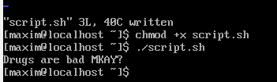  

**3.2.** Log in to the system as `guest`. Create directory `testdir` in the `/tmp`; put some file into `testdir` and prohibit user `user` from visitng this directory (i.e. `testdir`).  
```
su guest
whoami
mkdir /tmp/testdir
chmod o-x /tmp/testdir
chmod o-r /tmp/testdir
cd tmp/testdir
su user
whoami
cd tmp
cd testdir
```
See that user **user** is denied from visiting the `testdir`.  
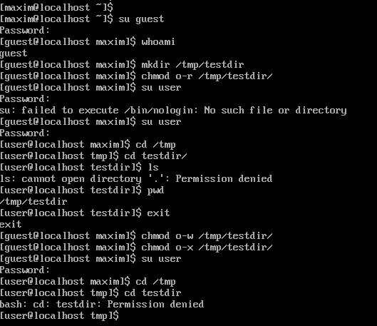  

**3.3** Test, if it possible to forbid an owner of some file to read to or write from this file.  
```
cd /tmp/testdir
touch ahtung.txt
echo "vse propalo" > ahtung.xt
cat ahtung.txt
---
$ vse propalo
---
chmod a-r ahtung.txt
cat ahtung.txt
---
$ Permission denied
---
chmod a-w ahtung.txt
echo "oh nooo" > ahtung.txt
---
$ Permission denied
---
```
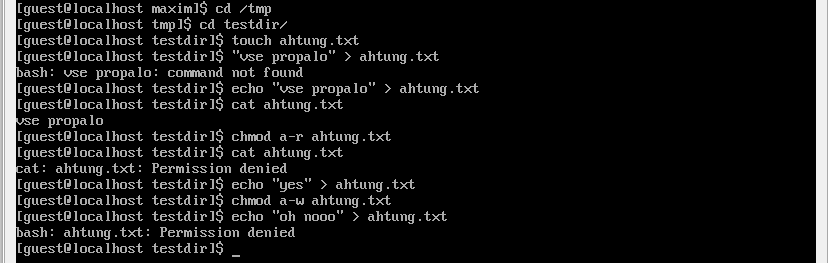  

___
 
_Thanks for your time!_  
 

