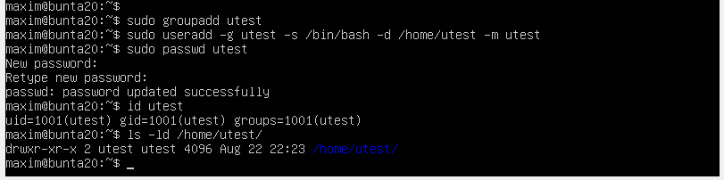
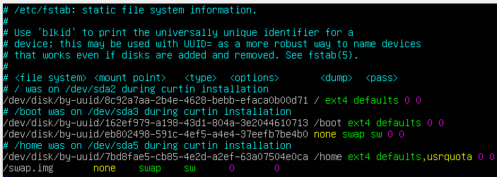
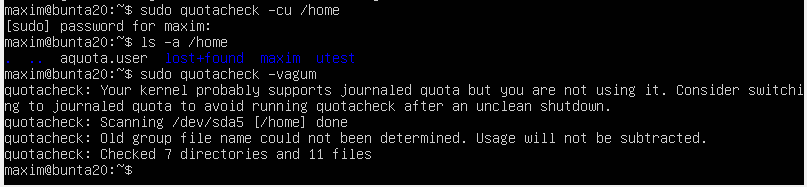
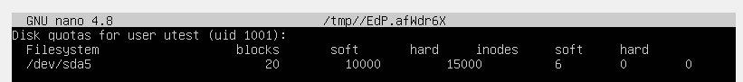
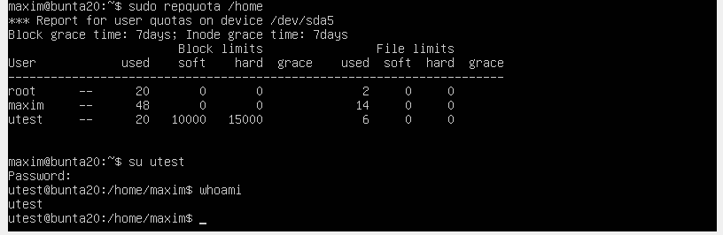
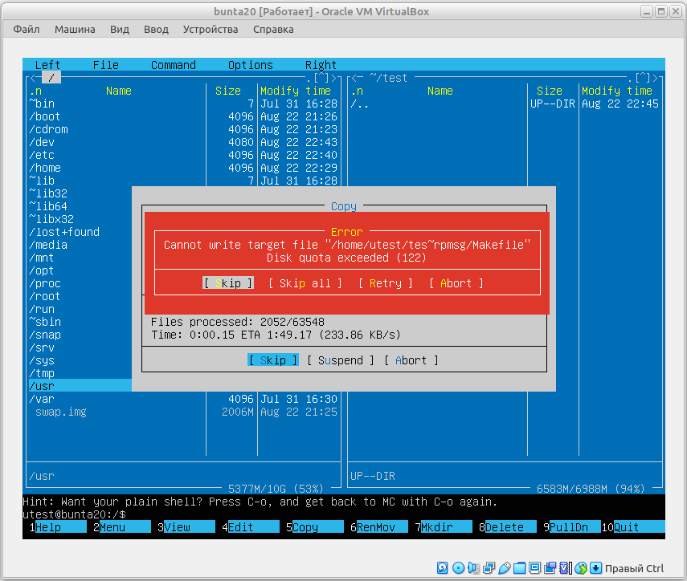
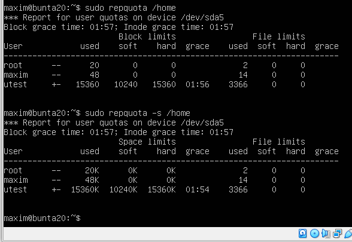

## Task 5.5
### Module 5. Linux

__In this task I work with Ubuntu 20 server__

**1.** Create a new user `utest`.  
```
sudo groupadd utest
sudo useradd -g utest -s /bin/bash -d /home/utest -m utest
sudo passwd utest
id utest
ls -ld /home/utest
```
  

Add the `usrquota` option in the `/etc/fstab`  
```
sudo apt install quota
sudo vi /etc/fstab
sudo reboot now
```


Based on the quota mechanism,  
```
sudo quotacheck -cu /home
ls -a /home
sudo quotacheck -vagum
```
  

limit the available disk space for `utest` to **soft**: 10M and **hard**: 15M. 
```
sudo edquta -u utest
sudo mount -o remount /home
```
  

**2.** Using MidnightCommander, copy content of `/usr` directory to `utest` home directory.  
```
sudo setquota -u utest 10M 15M 0 0 /home
sudo repquota /home
sudo edquota -t
su utest
whoami
mc
```
  

Copy files and get a quota warning:
  

And the report:  
```
sudo repquota /home
sudo repquota -s /home
```
  
___
 
_Thanks for your time!_  
 

