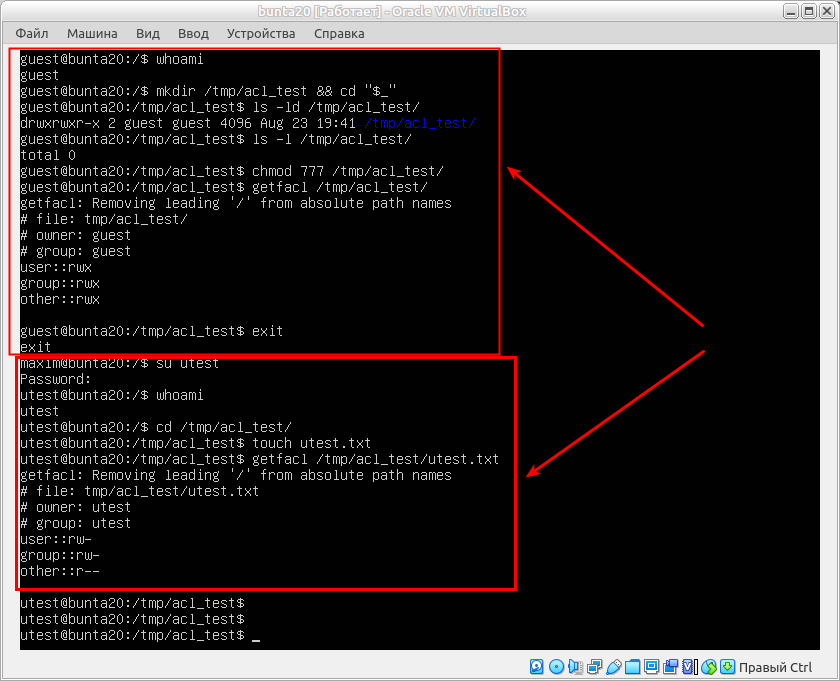

## Task 5.6
### Module 5. Linux

_In this task I work with Ubuntu 20 server_  

**The most task**: to allow user `utest` visit `guest`'s home directory.  
**The average task:** to acquaint with the basics of ACL and verify that ACL privileges override the chmod ones.  
```
sudo groupadd guest
sudo useradd -g guest -s /bin/bash -d /home/guest -m guest
sudo passwd guest
id guest
ls -ld /home/guest
id utest
```
  

**5.6.1.** .  
```
# find the partition with /home :
df -h
# home is on the /dev/sda5
mount -o remount -o acl /dev/sda5
tune2fs -l /dev/sda5
```
  

For the view UUID of disks, use `blkid` command from `guest` and with super privileges `sudo...`.  
As we can see, with  super privileges the UUID of `/dev/sda1` is displayed. From the `guest` - no:  
```
su guest
whoami
blkid
exit
sudo blkid
```
  

**5.6.2.** Log in as `guest`. Create in `/tmp` a directory called `acl_test`.  
By means of `chmod`, allow  `utest` to perform all possible operations (rwx) with respect to `acl_test`.  
Verify that user `utest` is indeed capable of implementing granted him privileges.  
For example, after logging in as `utest`, create a file in `/tmp/acl_test` - `utest.txt` by `touch`.  
Query information about the directory and file by calling:  
```
ls -ld /tmp/acl_test
ls -l /tmp/acl_test
```
To check ACL permissions do:
```
getfacl /tmp/acl_test
getfacl /tmp/acl_test/utest.txt
```

**5.6.3.** Employ ACL to block any activity except reading, for `utest` with dir `/tmp/acl_test` _(hint: `setfacl`)_.  
```
setfacl
```
Test if the actions are effectively prohibited
touch /tmp/acl_test/prohibited.txt
Is it possible to invoke this command?
echo “new content” > /tmp/acl_test/utest.txt
Test if user utest can be prevented from modifying content of the file utest.txt by means
of ACL. (Note that user utest is the owner of the file /tmp/acl_test/utest.txt).


**5.6.4.** Consider a situa=on when at the ACL level user utest is allowed to have all possible
privileges with respect to /tmp/acl_test, while no ac=on is allowed with chmod (con-
ven=onal mechanism). (Hint: repeat step 3, but given the new context).


**5.6.5.** For user utest, set default ACLs to the directory /tmp/acl_test which allow read-only
access (hint: use the -d op=on of the se4acl command). Being logged in as utest, invoke
touch to create the file utest2.txt in the /tmp/acl_test directory. Query permissions on
this file using ge4acl.


**5.6.6.** Set the maximum permissions mask on the /tmp/acl_test/utest.txt file in such a way
as to allow read-only access. Check permissions with ge4acl.


**5.6.7.** Delete all ACL entries rela=ve to the /tmp/acl_test directory.


  

  

  

  

  

  

  

  

  

  

  

___
 
_Thanks for your time!_  
 


