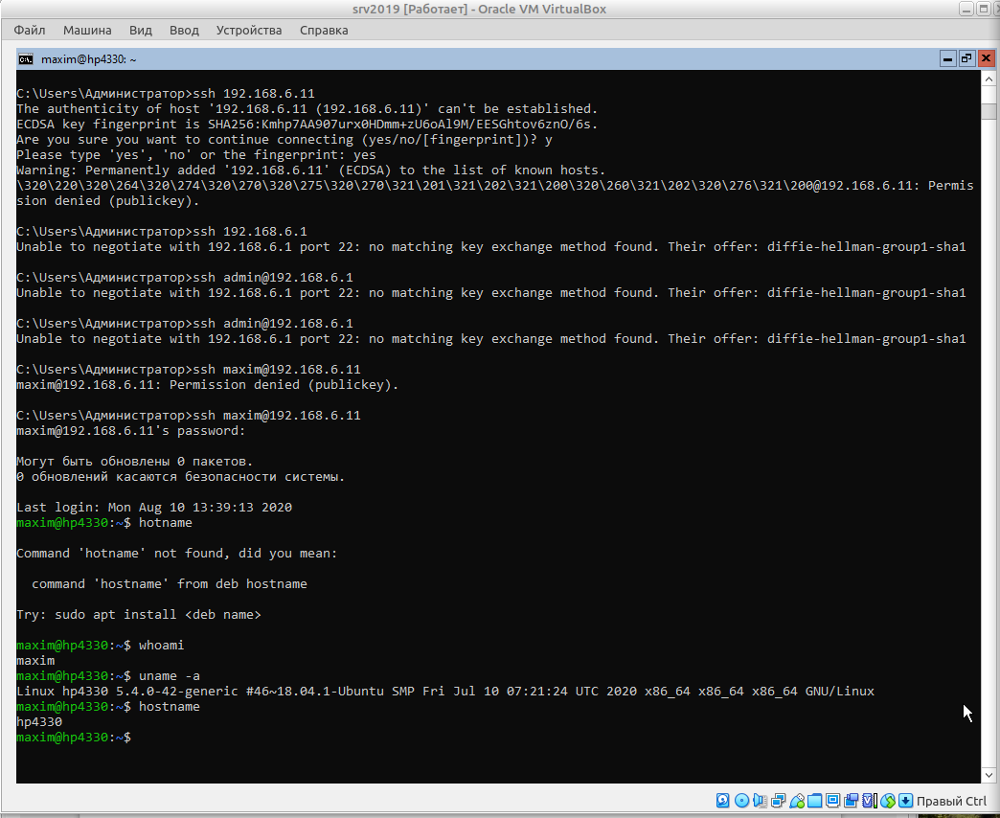
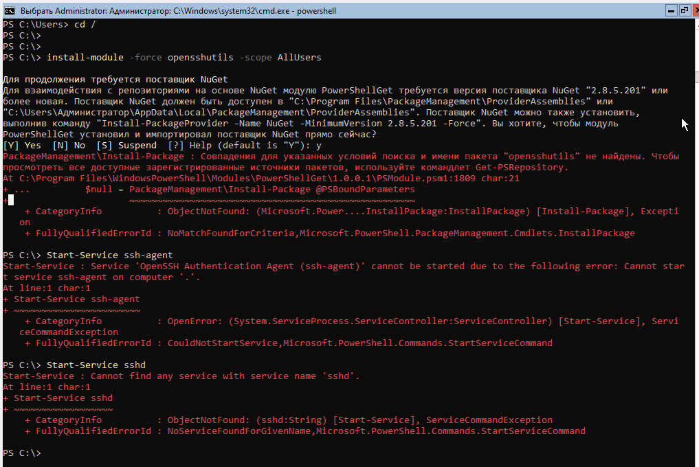
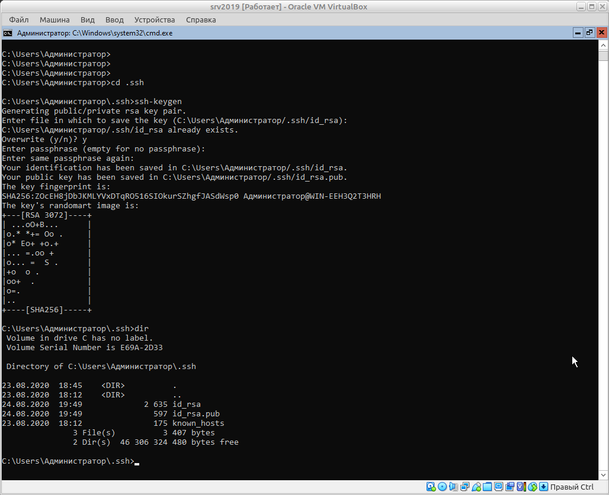

## Task 5.7
### Module 5. Linux

**5.7.1.** Check the implement ability of the most frequently used OPENSSH commands in the MS Windows 2019 Server.  
```
# check the status of openssh components:
Get-WindowsCapability -Online | ? Name -like 'OpenSSH*'
# enabling client and server openssh components:
Add-WindowsCapability -Online -Name OpenSSH.Client~~~~0.0.1.0
Add-WindowsCapability -Online -Name OpenSSH.Server~~~~0.0.1.0
```
But finally we got an error code 0x800f0950 - unable to install OpenSSH.Server~~~~0.0.1.0 in Windows 2019 Server   
  

Lets try to connect to other system from our Windows 2019 Server:  
```
#connect to the linux host:
ssh 192.168.6.11
#connect to the router:
ssh 192.168.6.1
ssh admin@192.168.6.1
```
With the router we could'n connect because the "diffie-hellman-group1-sha1" error message is shown.  
And the alert about access denied to the linux host (it needs no password, but publick key - we don't have it).  
After enabling on the linux host the ssh-authentication by password, we successfully connected from Windows:  
```
hostname
whoami
uname -a
```
  

Now do something with key management. Try to install OpenSSH module for all users and start agent and ssh:  
```
Install-Module -Force OpenSSHUtils -Scope AllUsers
Start-Service ssh-agent
Start-Service sshd
```
Unfortunatelly, these commands are finished with red alerts too:  
  

Finally is the time to generate a user key, this operation works well:  
```
cd ~\.ssh\
ls
ssh-keygen
ls
```
Now I have a public/private key pair.  
  

**5.7.2.** 


**5.7.3.** 


**5.7.4.** 


**5.7.5.** __optional/facultative__
  

___
 
_Thanks for your time!_  
 

