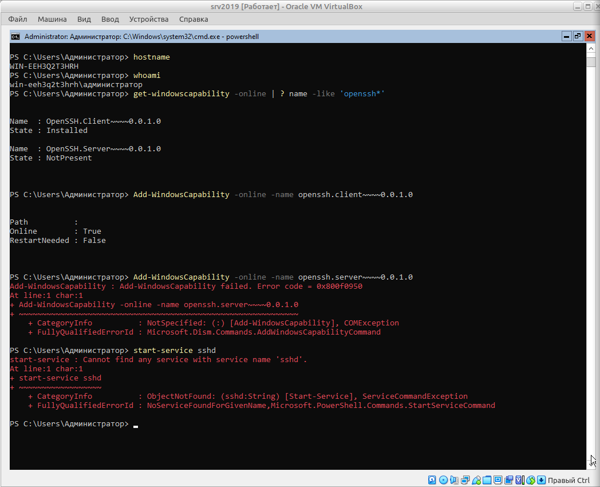
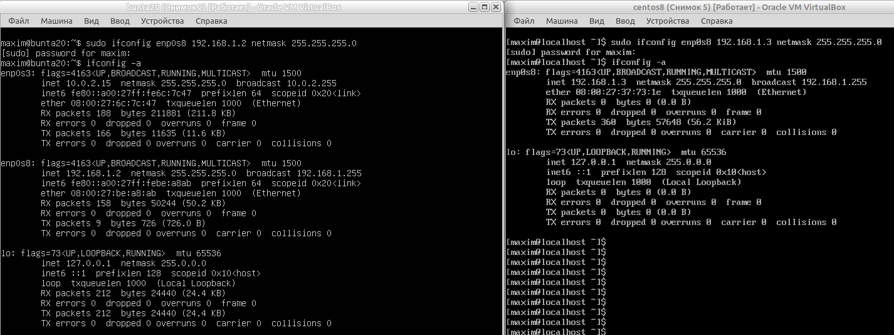
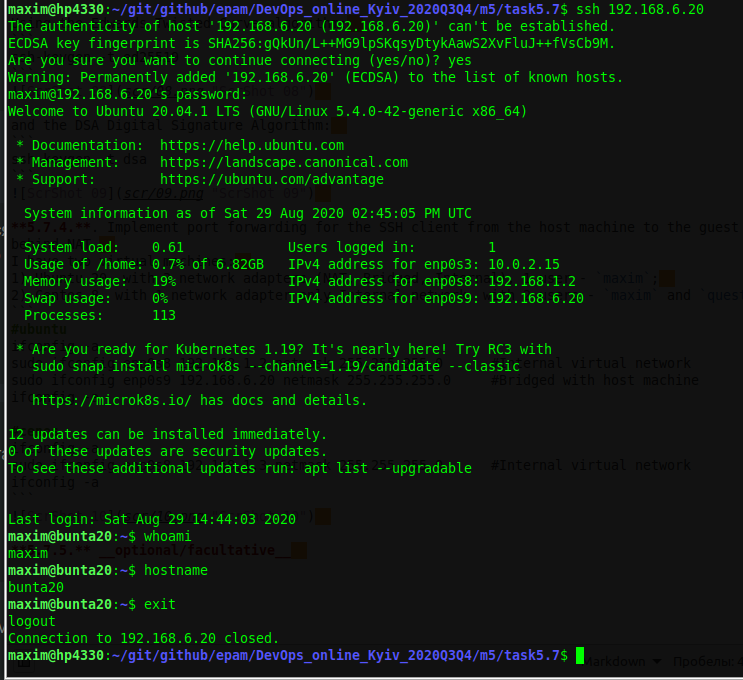
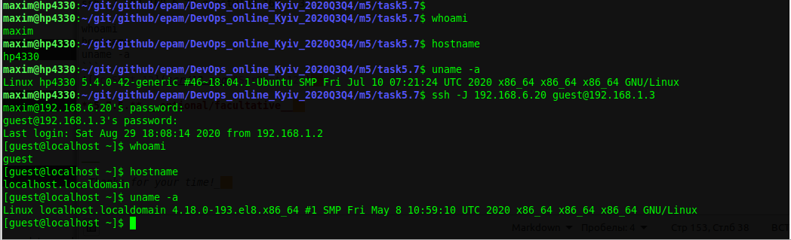

## Task 5.7
### Module 5. Linux

**5.7.1.** Check the implement ability of the most frequently used OPENSSH commands in the MS Windows 2019 Server.  
```
# check the status of openssh components:
Get-WindowsCapability -Online | ? Name -like 'OpenSSH*'
# enabling client and server openssh components:
Add-WindowsCapability -Online -Name OpenSSH.Client~~~~0.0.1.0
Add-WindowsCapability -Online -Name OpenSSH.Server~~~~0.0.1.0
```
But finally we got an error code 0x800f0950 - unable to install OpenSSH.Server~~~~0.0.1.0 in Windows 2019 Server   
  

Lets try to connect to other system from our Windows 2019 Server:  
```
#connect to the linux host:
ssh 192.168.6.11
#connect to the router:
ssh 192.168.6.1
ssh admin@192.168.6.1
```
With the router we could'n connect because the "diffie-hellman-group1-sha1" error message is shown.  
And the alert about access denied to the linux host (it needs no password, but publick key - we don't have it).  
After enabling on the linux host the ssh-authentication by password, we successfully connected from Windows:  
```
hostname
whoami
uname -a
```
  

Now do something with key management. Try to install OpenSSH module for all users and start agent and ssh:  
```
Install-Module -Force OpenSSHUtils -Scope AllUsers
Start-Service ssh-agent
Start-Service sshd
```
Unfortunatelly, these commands are finished with red alerts too:  
  

Finally is the time to generate a user key, this operation works well:  
```
cd .ssh\
ls
ssh-keygen
ls
```
Now I have a public/private key pair.  
  
 
**5.7.2.** Implementing basic SSH settings to increase the security of the client-server connection:  
- a) disable login with password;  
- b) set maximum authorization tries to 7;  
- c) allow authentication by public keys only;  
- d) change the default `22` port to the random `65103`;  
- e) disable the `root` ssh login (I have my `maxim` user in the system).  
```
sudo vi /etc/ssh/sshd_config
```
and change this lines as follow:
```
#Port 22
Port 65103

#MaxauthTries 6
MaxauthTries 7

#PermitRootLogin prohibit-password
PermitRootLogin no

#PubkeyAuthentication no
PubkeyAuthentication yes

#PasswordAuthentication yes
PasswordAuthentication no
```
  
  

And finally restart the service:  
```
sudo  service ssh restart
sudo  service sshd restart
```

**5.7.3.** List the options for choosing keys for encryption in SSH.  
```
man ssh-keygen
```
Specifies the type of key to create.  The possible values are “dsa”, “ecdsa”, “ed25519”, or “rsa” with option "-t".  
Implement 3 of them. First the  Rivest, Shamir и Adleman algoritm:  
```
ssh-keygen -t rsa
```
  

Using the Edwards Twisted Curve algorithm:  
```
ssh-keygen -t ed25519
```
  

and the DSA Digital Signature Algorithm:  
```
ssh-keygen -t dsa
```
  

**5.7.4.**. Implement port forwarding for the SSH client from the host machine to the guest Linux virtual machine behind NAT.  
I have two virtual machines:  
1) Ubuntu 20, with 3 network adapters (NAT, Bridged, Internal), 2 users - `maxim` and `quest`;  
2) Centos 8, with 1 network adapter only Internal network, with 2 users - `maxim` and `quest`;  
```
#ubuntu
ifconfig -a
sudo ifconfig enp0s8 192.168.1.2 netmask 255.255.255.0      #Internal virtual network
sudo ifconfig enp0s9 192.168.6.20 netmask 255.255.255.0     #Bridged with host machine
ifconfig -a

#cenos
ifconfig -a
sudo ifconfig enp0s8 192.168.1.3 netmask 255.255.255.0      #Internal virtual network
ifconfig -a
```
  

Try to connect SSH from host machine to the Ubuntu virtual through bridged network adapter,  
and inside the session connect to the Centos virtual through internal virtual network. Successful:  
```
whoami
hostname
uname -a

ssh 192.168.6.20
whoami
hostname
uname -a

ssh guest@192.168.1.3
whoami
hostname
uname -a
```
  

Now it's time to realize SSH port forwarding from host machine to the Centos in virtual netwotk, through Ubuntu as bridge (or "jump" host")":  
```
whoami
hostname
uname -a

ssh -J 192.168.6.20 guest@192.168.1.3

whoami
hostname
uname -a
```
  

**5.7.5.** __optional/facultative__  


___
 
_Thanks for your time!_  
 

