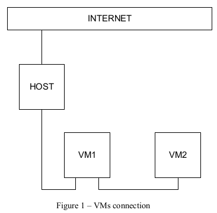
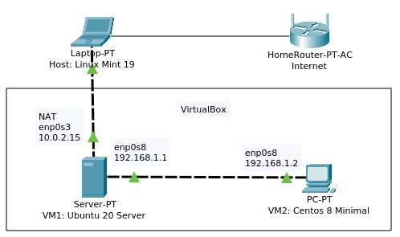
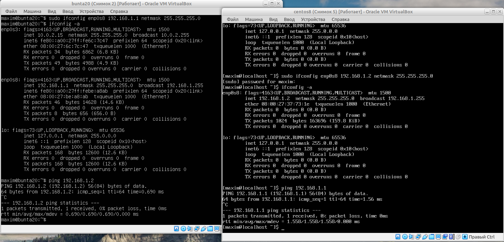
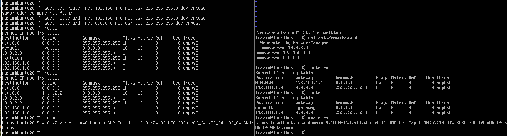
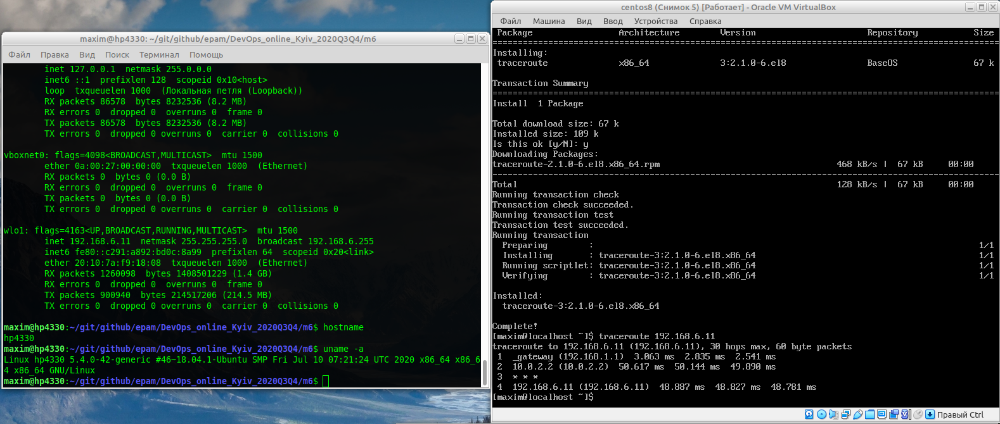
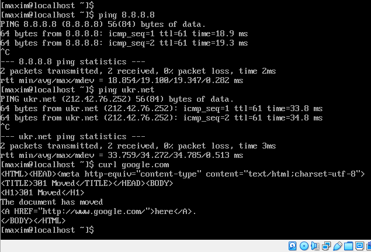
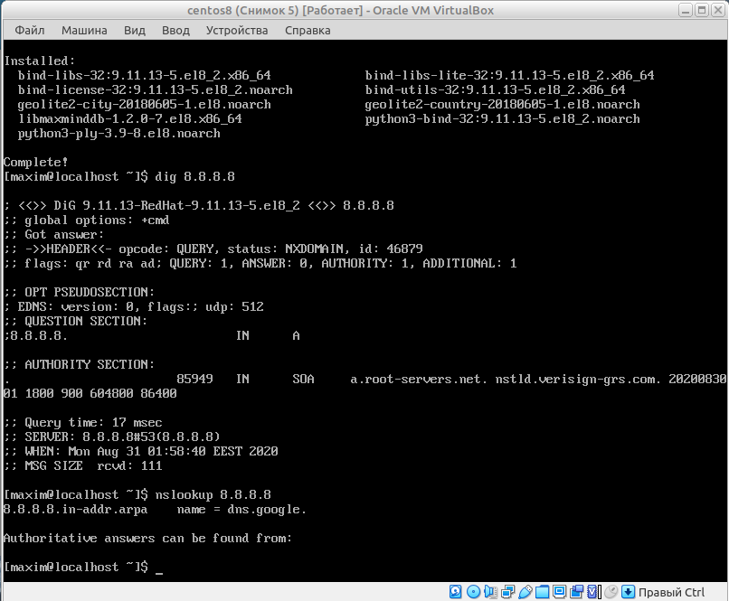
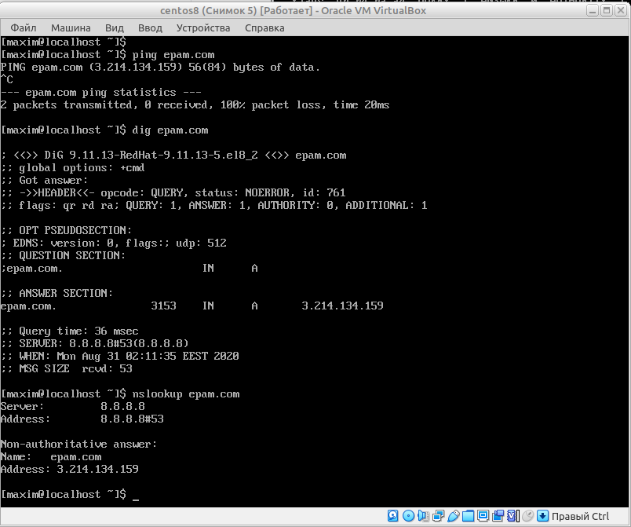
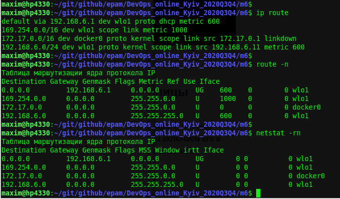
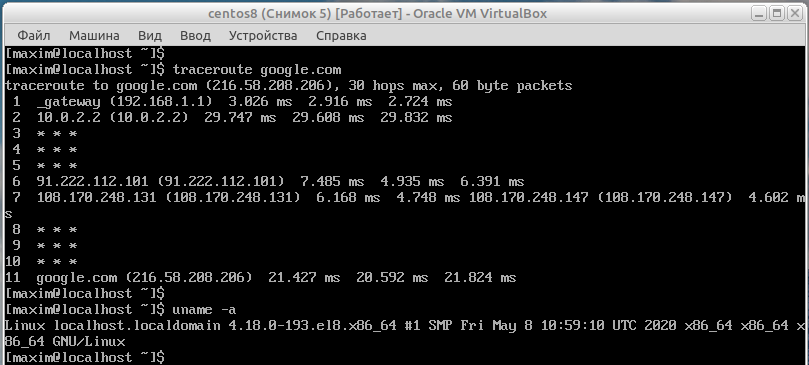

## Task 6a.1
### Module 6a. Linux Networking
#### IP routing

**6a.1.1.** Create virtual machines connection according to figure 1:  
  
Modeling in the Cisco PacketTracer:  
  

**6a.1.2.** VM2 has one interface (internal), VM1 has 2 interfaces (NAT and internal).  
Configure all network interfaces in order to make VM2 has an access to the Internet (iptables, forward, masquerade).  

```
# VM1: UBUNTU
ifconfig -a
sudo ifconfig enp0s8 192.168.1.1 netmask 255.255.255.0
ifconfig -a
ping 192.168.1.2
```
```
# VM2: CENTOS
ifconfig -a
sudo ifconfig enp0s8 192.168.1.2 netmask 255.255.255.0
ifconfig -a
ping 192.168.1.1
```
  

```
# VM1: UBUNTU
sudo apt install dnsmasq

sudo vi /etc/sysctl.conf
# uncomment the next one line: 
net.ipv4.ip_forward=1

sudo sysctl -w net.ipv4.ip_forward="1"
sudo iptables -t nat -A POSTROUTING -o enp0s3 -j MASQUERADE
sudo iptables-save > /etc/iptables.up.rules

sudo vi /etc/network/interfaces
# add this three lines to the end: 
pre-up iptables-restore < /etc/iptables.up.rules
up route add -net 192.168.1.0 netmask 255.255.255.0 dev enp0s8
up route add -net 0.0.0.0 netmask 255.255.255.255 dev enp0s3
route
route -n
uname -a
```
```
# VM2: CENTOS
sudo  vi /etc/resolv.conf
# edit the next two lines: 
nameserver 8.8.8.8
nameserver 192.168.1.1

route
sudo route add default gw 192.168.1.1 enp0s8
route -n
uname -a
```
  

**6a.1.3.** Check the route from VM2 to Host - **O`k**.  
```
# VM2: CENTOS
sudo yum install traceroute
traceroute 192.168.6.11
```
```
# HOST: MINT
ifconfig -a
uname -a
```
  

**6a.1.4.** Check the access to the Internet, (just ping, for example, 8.8.8.8) - **O`k**.  
```
# VM2: CENTOS
ping 8.8.8.8
ping ukr.net
curl google.com
```
  

**6a.1.5.** Determine, which resource has an IP address 8.8.8.8 - **dns.google**.  
```
# VM2: CENTOS
sudo yum install bind-utils
dig 8.8.8.8
nslookup 8.8.8.8
```
  

**6a.1.6.** Determine, which IP address belongs to resource epam.com - **3.214.134.159**.  
```
# VM2: CENTOS
ping epam.com
dig epam.com
nslookup epam.com
```
  

**6a.1.7.** Determine the default gateway for your HOST and display routing table - **GW is 192.168.6.1**.  
```
# HOST: MINT  
ip route
route -n
netstat -rn
```
  

**6a.1.8.** Trace the route to google.com.  
```
# VM2: CENTOS
#sudo yum install bind-utils
traceroute google.com
```
  
___
 
_Thanks for your time!_  
