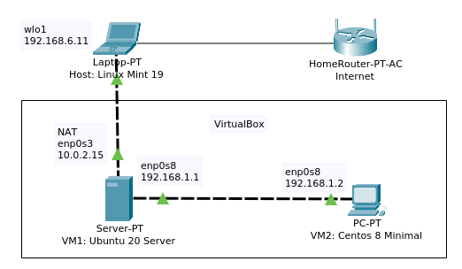

## Task 6a.1
### Module 6a. Linux Networking
#### IP routing

**6a.1.1.** Create virtual machines connection according to figure 1:  
  

**6a.1.2.** 

  

**6a.1.3.** 

  

**6a.1.4.** 

  

**6a.1.5.** 

  

**6a.1.6.** 

  

**6a.1.7.** 

  

**6a.1.8.** 

  

  

  
___
 
_Thanks for your time!_  
