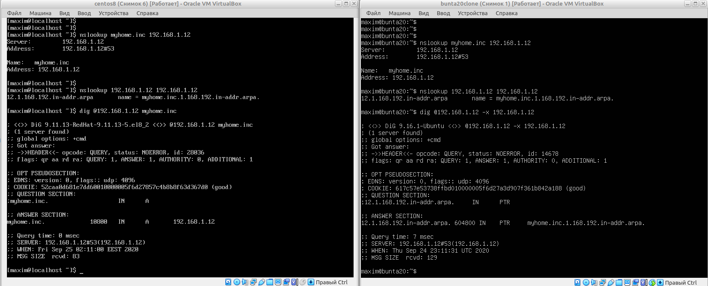

## Task 6a.2.
### Module 6a. Linux Networking
#### Configuring DHCP, DNS servers and dynamic routing using OSPF protocol

:heavy_check_mark: **6a.2.1.** Use already created internal-network for three VMs (VM1-VM3).  
VM1 has NAT and internal, VM2, VM3 – internal only interfaces:  
  

Modeling in the Cisco PacketTracer. For the VM3 I used a clone of VM1 with new mac addresses.  
  

:heavy_check_mark: **6a.2.2.** Install and configure DHCP server on VM1.  
_(3 ways: using  , DNSMASQ and ISC-DHSPSERVER)_. Firstly I try to use a DNSMASQ DHCP on `enp0s8` interface.  
```bash
sudo apt-get install dnsmasq
sudo vim /etc/dnsmasq.conf
---
interface=enp0s8
domain=myhome.inc
dhcp-range=192.168.1.20,192.168.1.100,24h
dhcp-option=3,192.168.1.1
dhcp-option=1,255.255.255.0
dhcp-host=08:00:27:be:a8:ab,bunta20,192.168.1.1
---
dnsmasq --test
sudo service dnsmasq restart
sudo service dnsmasq status
```
But I got an error message about 53 TCP port is already in use.  
`sudo netstat -lntp`  
So I changed settings for `systemd-resolve` as described in the article:  
https://andreyex.ru/ubuntu/kak-osvobodit-port-53-ispolzuemyj-systemd-resolved-v-ubuntu/  

  

But I have got a lot of problems with network, and it doesn't work.

So I revert virtual machine to the previous state, and used a Virtualbox DHCP by command:  
```
vboxmanage dhcpserver add --netname intnet --ip 192.168.1.1 --netmask 255.255.255.0 --lowerip 192.168.1.10 --upperip 192.168.1.20 --enable
```

:heavy_check_mark: **6a.2.3.** Check VM2 and VM3 for obtaining network addresses from DHCP server.  

Boot one of the virtual machine and see that it's enp0s3 interface has got a 192.168.1.10 address by DHCP  
  

This is a CENTOS machine. But on both UBUNTU (VM1 and VM2) the DHCP addresses aren't assigned.  
I resolved this problem by next commands:
```
---
# VM1
---
dhclient -r enp0s8
sudo dhclient enp0s8
ifconfig
---
# VM3
---
dhclient -r enp0s9
sudo dhclient enp0s9
ifconfig
```
After that both UBUNTU VM have got DHCP addresses (192.168.1.11 and 192.168.1.12):
  

:heavy_check_mark: **6a.2.4.** Using existed network for three VMs (from p.1),  
install and configure DNS server on VM1. _(using DNSMASQ, BIND9)._ I prefer to use a BIND9 DNS.  

On the VM1 Step by step do the settings as described in the article:  
https://itproffi.ru/ustanovka-i-nastrojka-dns-servera-bind-v-linux/  
```
sudo apt-get install bind9 bind9utils dnsutils bind9-doc

#Creating a file for DNS zone 
cd /etc/bind
sudo mkdir -p zones/master
cd zones/master/

#Edit master zone
sudo touch db.myhome.inc
sudo vim db.myhome.inc 
---
;
$TTL 3h
@ IN SOA ns1.myhome.inc. admin.myhome.inc. (
1 ; серийный номер
3h ; обновление каждые 3 часа
1h ; повторная попытка через час
1w ; срок годности – 1 неделя
1h ) ; хранение кэша отказов 1 час;
@ IN NS ns1.myhome.inc.

myhome.inc. IN A 192.168.1.12
ns1 IN A 192.168.1.12
---
```
  

Set up a reverse zone:  

```
sudo touch db.192.168.1
sudo vim db.192.168.1
---
$TTL 604800
1.168.192.in-addr.arpa. IN SOA ns1.myhome.inc. admin.myhome.inc. (
1 ; серийный номер
3h ; обновление каждые 3 часа
1h ; повторная попытка через час
1w ; срок годности – 1 неделя
1h ) ; хранение кэша отказов 1 час;
1.168.192.in-addr.arpa. IN NS ns1.myhome.inc.
12.1.168.192.in-addr.arpa. IN PTR .myhome.inc.
---
```
  

Adding configuration to the BIND:  
```
sudo vim /etc/bind/named.conf.local
---
zone "myhome.inc" {
type master;
file "/etc/bind/zones/master/db.myhome.inc";
};

zone "1.168.192.in-addr.arpa" {
type master;
file "/etc/bind/zones/master/db.192.168.1";
};
---
```
  

Add external DNS to the `named.conf`. Use 1.1.1.1 - CloudFlare provider:  
```
cat /etc/binf/named.conf
sudo vim /etc/binf/named.conf.options
---
/// forwarders {
// 1.1.1.1;
// };
---
```
  

:heavy_check_mark: **6a.2.5.** Check VM2 and VM3 for gaining access to DNS server (naming services).  

:negative_squared_cross_mark: **6a.2.6.** *optional, addition task*  
Using the scheme which follows, configure dynamic routing using OSPF protocol.  

:heavy_check_mark: **6a.2.7.**  Check results.  

Check DNS settings by commands, see that all right, and start the server:  
```
named-checkconf
named-checkzone myhome.inc /etc/bind/zones/master/db.myhome.inc
named-checkzone 1.168.192.in-addr.arpa /etc/bind/zones/master/db.192.168.1

sudo service bind9 start
sudo service bind9 restart
rndc reload
```
  

Now go to the VM2 (CENTOS) and check zones by nslookup and DIG to check master zone:  
```
nslookup myhome.inc 192.168.1.12
nslookup 192.168.1.12 192.168.1.12
dig @myhome.inc 192.168.1.12
```
And on the VM3 (cloned UBUNTU) do the same with nslookup, but DIG - for the reverse zone test:  
```
nslookup myhome.inc 192.168.1.12
nslookup 192.168.1.12 192.168.1.12
dig @192.168.1.12 -x 192.168.1.12
```
  

See that all right!
___
 
_Thanks for your time!_  
