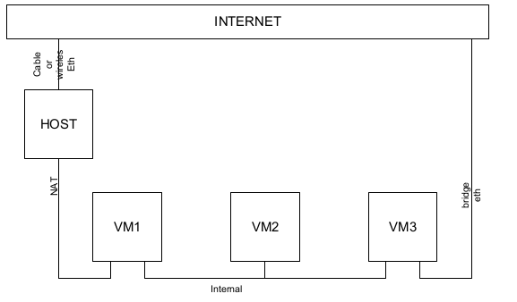
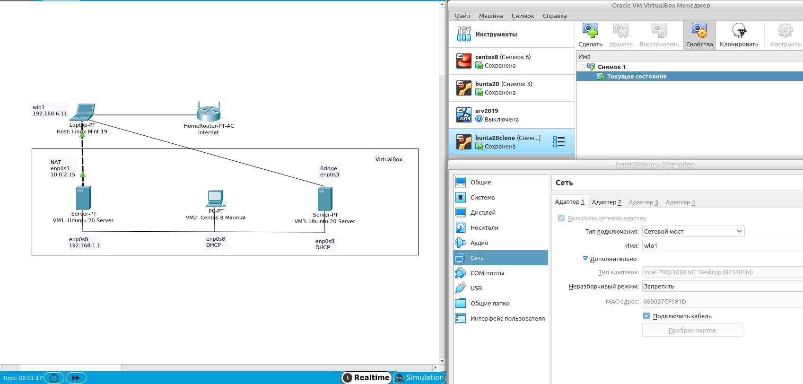
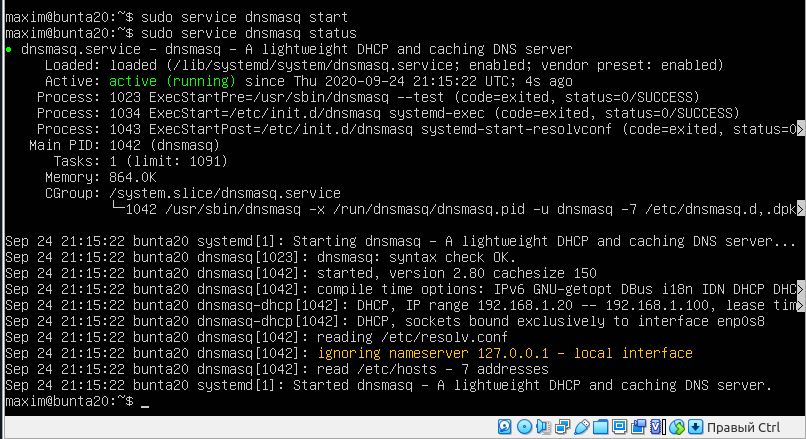
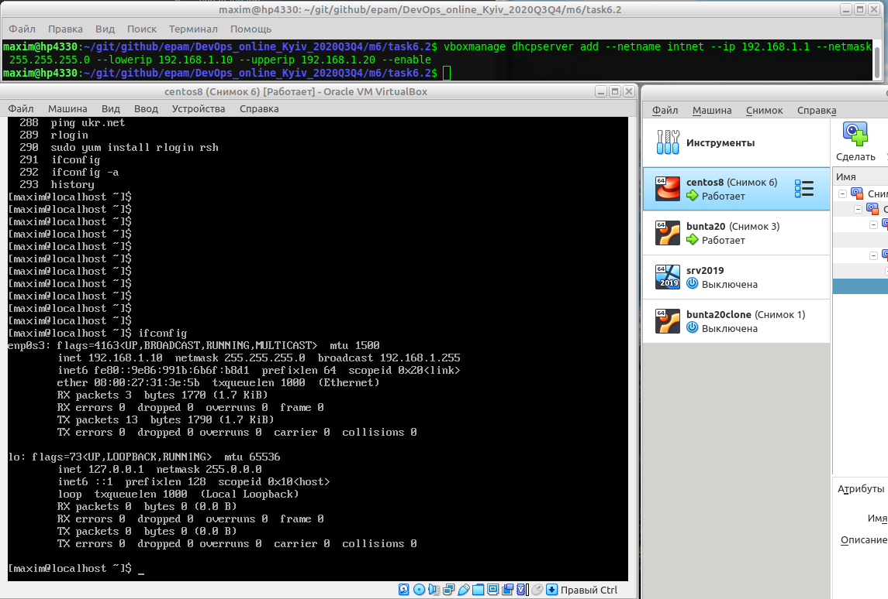
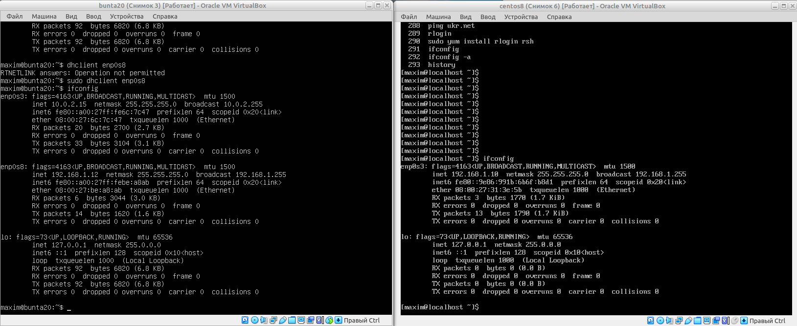
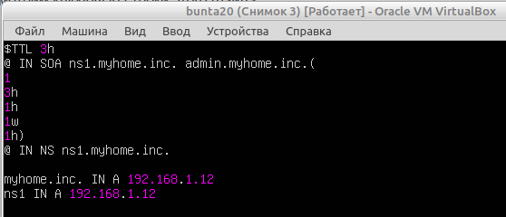
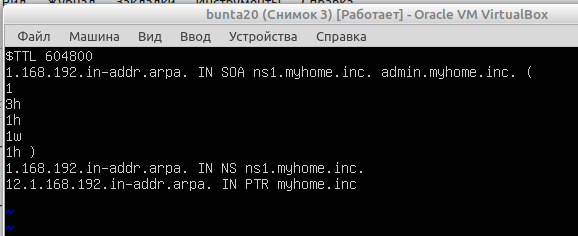
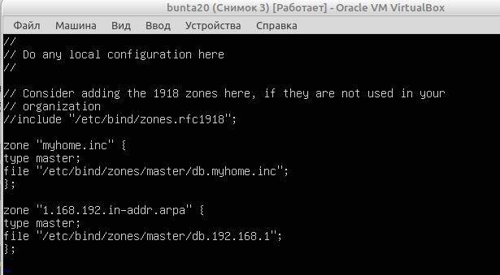
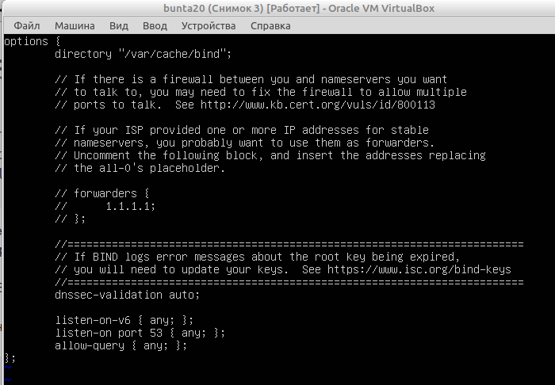
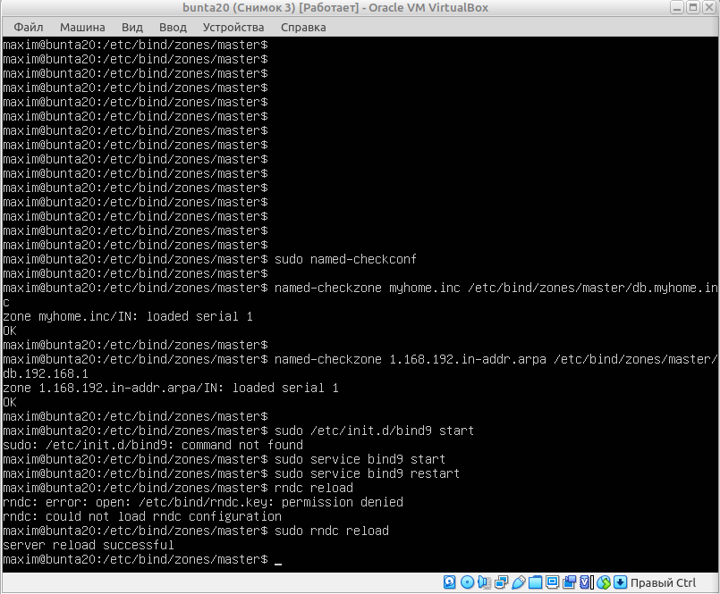

## Task 6a.2.
### Module 6a. Linux Networking
#### Configuring DHCP, DNS servers and dynamic routing using OSPF protocol

:heavy_check_mark: **6a.2.1.** Use already created internal-network for three VMs (VM1-VM3).  
VM1 has NAT and internal, VM2, VM3 – internal only interfaces:  
  

Modeling in the Cisco PacketTracer:
  

:white_check_mark: **6a.2.2.** Install and configure DHCP server on VM1.  
_(3 ways: using  , DNSMASQ and ISC-DHSPSERVER)_. I will use a VBoxManaged DNS.  

  

:white_check_mark: **6a.2.3.** Check VM2 and VM3 for obtaining network addresses from DHCP server.  

  

:white_check_mark: **6a.2.4.** Using existed network for three VMs (from p.1),  
install and configure DNS server on VM1. _(using DNSMASQ, BIND9 or something else)._  

  

:white_check_mark: **6a.2.5.** Check VM2 and VM3 for gaining access to DNS server (naming services).  

  

:negative_squared_cross_mark: **6a.2.6.** _optional, addition task_  
Using the scheme which follows, configure dynamic routing using OSPF protocol.  

:white_check_mark: **6a.2.7.**  Check results.  

  

  

  

  
___
 
_Thanks for your time!_  
